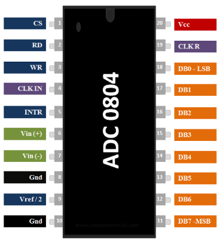
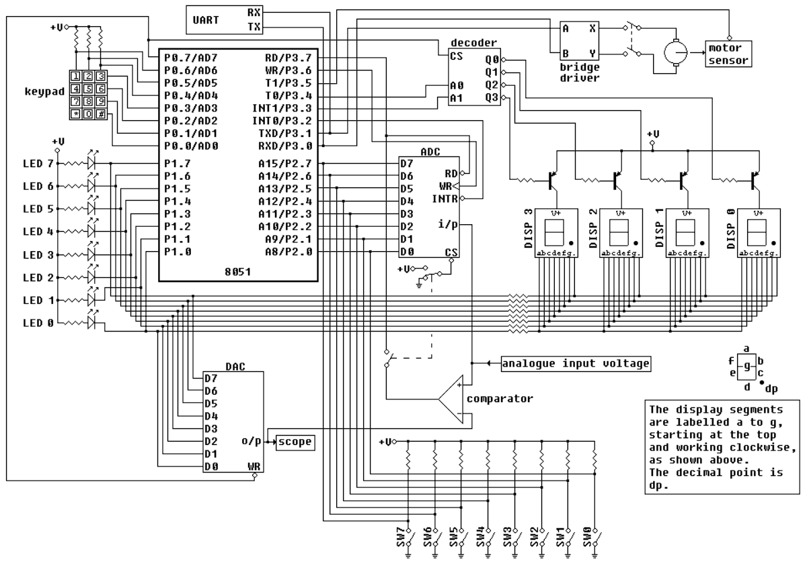

## **Introduction**

An Analog-to-Digital Converter (ADC) is an electronic device that converts analog signals, such as voltage or current, into equivalent digital values that can be understood and processed by a microcontroller. In this experiment, the ADC0804 is used in conjunction with the 8051 microcontroller, and the corresponding voltage value is displayed on two multiplexed 7-segment displays. This setup provides a clear demonstration of how real-world analog signals, such as those from sensors, can be measured, digitized, and displayed in human-readable voltage form.

## **Key Components**

The system primarily consists of three parts: the 8051 microcontroller, the ADC0804 converter, and the 7-segment display. The 8051 microcontroller is responsible for controlling the entire process—it reads the converted 8-bit digital data from the ADC, processes it, and drives the display units. The ADC0804, which is a single-channel 8-bit analog-to-digital converter, works on the principle of successive approximation. It converts one analog voltage (0–5V typically) into an 8-bit digital value ranging from 0–255. The microcontroller then performs a simple calculation to convert this digital value into its equivalent voltage, which is shown on two multiplexed 7-segment displays.

  

<b>Fig. 1 – ADC 0804</b>

## **Working Principle**

The working of the system begins with the analog signal, which may be provided by a potentiometer or a sensor. This analog input is fed to pin VIN+ of the ADC0804, while VIN– is usually grounded. To start the conversion, the microcontroller sends a low-to-high pulse on the WR pin. The ADC then converts the analog voltage into its 8-bit digital equivalent using successive approximation. During the conversion, the INTR pin remains high. Once the conversion is complete, the INTR pin goes low, signaling that data is ready to be read. The microcontroller then brings the RD pin low and reads the 8-bit digital output from the ADC through Port 0. This binary data is processed and converted into a voltage value (in volts and tenths of a volt). Finally, the voltage is displayed on two multiplexed 7-segment displays, with one digit showing the integer part and the other showing the decimal part, giving a clear numeric indication of the measured voltage.

  

<b>Fig. 2 – Circuit Diagram of ADC0804 Interfacing with 8051 and 7-Segment Display</b>

## **Applications**

The interfacing of an ADC with a microcontroller for voltage measurement has a wide range of practical applications. It forms the basis of digital voltmeters, where analog voltage levels are measured and displayed in numeric form. In temperature measurement systems, sensors provide analog temperature signals that are digitized and displayed as corresponding voltages. ADCs are also widely used in sensor interfacing for embedded systems, allowing devices such as pressure sensors, light sensors, and gas sensors to be integrated with digital processors. Furthermore, ADCs are an integral part of data acquisition systems, where analog signals must be continuously monitored, digitized, and displayed or recorded for further analysis.

## **Advantages**

The ADC0804 provides several advantages that make it suitable for educational and practical applications. It offers 8-bit resolution with 256 quantization steps for representing analog signals. Unlike ADC0808, it is a simpler, single-channel device, which makes it ideal for experiments where only one analog signal needs to be converted. The ADC0804 is low-cost, easy to interface with microcontrollers like the 8051, and reliable for real-time applications, making it an ideal choice for embedded system projects and experiments where voltage measurement and display are required.
